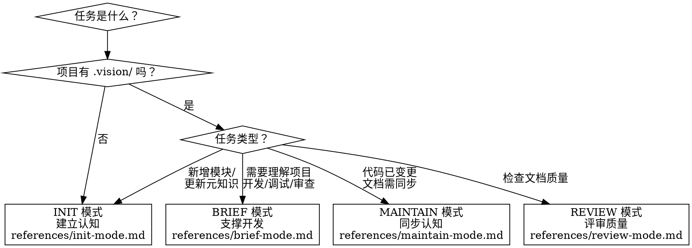

# Vision Maker

为项目构建和维护文档体系的认知框架。帮助人/智能体对项目从顶层视角（概念、目标、问题、成功标准）到实现细节（代码、数据、产出）建立完整认知。

## 核心模型

```
vision-maker = 思维模型 + 方法论（本技能，不变）
             + 项目元知识（.vision/.meta/knowledge.md，项目特定）
             → 驱动文档体系的建立、维护、评审
```

本技能不包含任何行业/领域的具体知识。它是一个认知框架——告诉智能体"如何为项目构建和维护文档体系"，而非"该写什么内容"。具体内容由项目元知识驱动。

## 模式选择



| 模式 | 触发条件 | 核心职责 | 详细流程 |
|------|---------|---------|---------|
| **INIT** | 新项目 / 已有项目首次接入 / 新模块 / 元知识更新 | 采集项目元知识，建立文档体系 | [init-mode.md](references/init-mode.md) |
| **BRIEF** | 需要理解项目以支撑开发、调试、审查等任务 | 按任务需求暴露完整的项目知识链 | [brief-mode.md](references/brief-mode.md) |
| **MAINTAIN** | 项目内容发生变更后 | 审慎检查变更影响，同步受影响文档 | [maintain-mode.md](references/maintain-mode.md) |
| **REVIEW** | 需要评估文档质量（定期或手动触发） | 按多维度评审文档体系或单个文档 | [review-mode.md](references/review-mode.md) |

各模式的触发方式由项目集成环境决定（人手动触发、CI 集成等），本技能定义"做什么"，不绑定特定触发机制。

## 用户适配原则

本技能服务的用户（人类侧）具有典型认知局限。Skill 必须据此调整交互方式：

| 特征 | 适配策略 |
|------|---------|
| **知识面有限** | 默认视为新手，通过对话动态刻画知识面，决定详略 |
| **思维散点化** | 主动将零散想法组织为结构化认知面 |
| **方法论有限** | 主动上升到方法论层面解释和引导 |
| **记忆有限** | 输出始终包含完整上下文，跨会话帮助恢复 |
| **决策疲劳** | 精简选项 + 明确推荐 + 推荐理由 |
| **锚定偏差** | 主动暴露盲区和替代视角 |
| **领域专家 ≠ 文档专家** | 引导隐性知识外化为结构化文档 |

详见 [user-adaptation.md](references/user-adaptation.md)

## `.vision/` 目录结构

```
.vision/
├── .meta/                          # 元信息层
│   ├── knowledge.md                # 项目元知识（纳入版本控制）
│   └── user.local.md               # 用户个人画像（不纳入版本控制）
├── VISION.md                       # 项目顶层文档（文档图根节点）
└── <layer-name>/                   # 语义化层级目录（由元知识定义）
    ├── <topic>.md
    ├── adr/                        # 架构决策记录
    └── <topic>/
        ├── <document>.md
        └── references/             # 附属资源（Tier 3）
```

- 层级目录名称由 `knowledge.md` 中的文档粒度定义决定，必须具有语义
- 版本控制：`.vision/.meta/*.local.md` 应加入 `.gitignore`

## 文档 Front-matter 规范

每份文档（除 `knowledge.md` 外）通过 front-matter 自描述和自导航：

```yaml
---
description: "一两句话摘要（< 100 tokens）"
type: explanation | reference | guide | context
concepts: [核心概念标签]
depends_on: [前置知识文档路径]
children: [更细粒度文档路径]
referenced_by: [横向关联文档路径]
last_verified: 2026-03-26
---
```

三种关系类型构成文档**有向图**：
- `depends_on`（向上）— 知识的前置依赖
- `children`（向下）— 知识的细粒度展开
- `referenced_by`（横向）— 非上下级的概念关联

所有路径相对于 `.vision/` 目录。详见 [front-matter-spec.md](references/front-matter-spec.md)

## 三级加载协议

控制**单文档内部**的加载粒度，而非文档间的遍历深度：

| 层级 | 内容 | 上下文开销 |
|------|------|-----------|
| **Tier 1 — 发现** | front-matter 的 `description` + `concepts` | 每文档 ~1-2 行 |
| **Tier 2 — 加载** | 文档正文（建议 < 5000 tokens） | 受控 |
| **Tier 3 — 深入** | 正文引用的附属资源（图表、schema 等） | 按需 |

**BRIEF 模式下文档间的关系遍历不设深度限制。** 沿 `depends_on` 完整上溯获取知识链，加载范围由任务需求决定。

## 人机协作模型

智能体主导执行，人在关键节点审查和补充：

- **INIT**：智能体引导对话采集信息 → 人确认元知识和文档蓝图
- **BRIEF**：智能体自主组装上下文 → 人/智能体消费
- **MAINTAIN**：智能体检测变更并提出修改建议 → 人审批
- **REVIEW**：智能体执行评审 → 人确认评审结论和改进措施

## 设计原则

| 原则 | 说明 |
|------|------|
| **方法论，不是模板** | 提供思维框架，具体内容由元知识驱动 |
| **元信息层与文档体系分离** | `.meta/` 指导工作，文档体系面向消费者 |
| **适配用户认知水平** | 动态刻画知识面，调整详略，主动暴露盲区 |
| **散点组织成面** | 将零散想法组织为结构化认知 |
| **文档自描述、自导航** | front-matter 携带元数据和关系，无需外部索引 |
| **三级加载控制上下文** | description → 正文 → 附属资源 |
| **关系遍历不设深度限制** | 按任务需求完整加载知识链 |
| **语义化组织** | 目录名由元知识定义，反映项目认知粒度 |
| **文档与项目始终一致** | MAINTAIN 确保文档是活的 |
