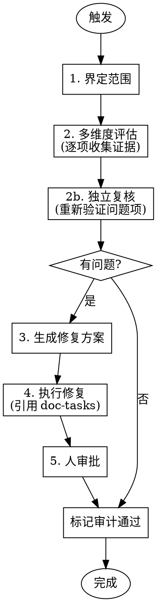
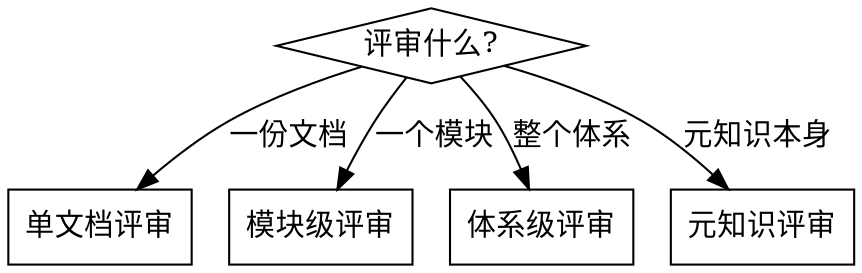

# AUDIT 模式 — 评估文档质量和一致性

## 设计定位

合并原 MAINTAIN + REVIEW。对文档体系进行一致性和质量评估，覆盖所有评估维度和触发场景。

**合并理由**：准确性评估逻辑重复；"一致性"是"质量"的子集；区别仅在范围界定方式，应作为参数而非两个模式。

## 响应协议

| 项 | 定义 |
|---|------|
| 触发方式 | 自动（pre-commit hook）/ 人工 |
| 触发示例 | "评审 .vision 文档质量" / "代码改完了，检查文档一致性" / "对 .vision 做全面体检" |
| 输入 | 变更驱动：git diff + 追溯未检查提交；人工：用户指定范围 |
| 评估维度 | 准确性 + 完整性 + 必要性 + 可参考性 + 关系完整性 + 项目特定维度 |
| 执行深度 | 见下表 |
| 输出 | 诊断报告（问题分类 + 修复建议）/ pass 标记 |
| 衔接 | 有问题：推荐修复提示词；无问题：推荐下次审计时机 |

## 执行深度

| 触发场景 | 范围界定 | 维度 | 深度 | 产出 |
|---------|---------|------|------|------|
| pre-commit 自动 | 变更文件→受影响文档+追溯 | 准确性+关系+变更完整性 | 仅诊断 | pass/fail + 报告 |
| 人工一致性检查 | 用户指定或变更驱动 | 准确性+关系+完整性 | 诊断+修复方案 | 报告→doc-tasks修复 |
| 人工全面评审 | 单文档/模块/体系/元知识 | 全维度 | 深度评审 | 评审报告 |
| INIT 后验证 | 全体系 | 全维度 | 诊断 | 评审报告 |

## 评估范围界定规则

1. **变更文件 → 提取 concepts → 匹配 .vision/ 文档**
2. **沿 depends_on / referenced_by 扩展一层**
3. **追溯**：本次变更 + 向前至上一个审计通过标记
4. **全量评估触发条件**（满足任一）：
   - 首次执行
   - 追溯超过5次仍无标记
   - 累计变更涉及20%以上文件

## 评审维度

### 基础维度（适用所有项目）

| 维度 | 检查内容 |
|------|---------|
| **必要性** | 这份文档是否有存在的理由？是否有消费者需要它？是否与其他文档重复？ |
| **完整性** | 文档是否覆盖了它 `concepts` 字段声称的所有概念？是否有遗漏？ |
| **准确性** | 文档内容是否与当前代码/架构一致？是否有过时描述？ |
| **可参考性** | 文档结构是否清晰？人/智能体是否能快速找到所需信息？ |
| **关系完整性** | `depends_on` / `children` / `referenced_by` 是否有效？双向一致？ |

### 项目特定维度

由 `.vision/.meta/knowledge.md` 中的"评审维度"章节定义。在 INIT 阶段与用户共同确定。

## 工作流程



### 步骤 1：界定范围

根据触发场景确定评估范围（参见执行深度表）。

### 步骤 2：多维度评估

按评审维度逐项检查，每个检查项**必须附带证据**后才能下结论。

**无证据断言是审计误判的首要根因。** 智能体倾向于"凭印象"下结论（如"front-matter 中未定义某字段"），而非逐字验证。以下流程强制要求证据先行：

#### 2a. 证据收集（每个检查项独立执行）

对每个检查维度，按以下流程收集证据：

1. **读取目标文件**——不要凭记忆判断，每次都要重新读取
2. **逐字段核对**——对 front-matter 等结构化区域，逐字段（而非整块扫描）确认
3. **记录证据**——格式：`文件路径:行号 → 具体内容`
4. **仅当证据收集完毕后**，才能标记"通过"或"问题"

#### 2b. 关系完整性检查的系统化方法

关系检查（`depends_on` / `children` / `referenced_by` 的双向一致性）**禁止抽查式检查**，必须按以下流程执行：

1. **建映射表**：遍历所有文档，收集每个 `referenced_by` 条目，建立 A→B 映射
2. **逐对校验**：对每对 A→B，验证 B 的对应字段是否包含 A
3. **区分单向引用与双向不一致**：
   - B 正文中引用了 A 的概念 → 双向不一致（需修复）
   - B 正文中未引用 A → 单向引用（合理，无需修复）
4. **先报告映射表**，再下结论

#### 2c. 独立复核

在输出"问题清单"前，对每个标记为"问题"的检查项**独立复核**：
- 重新读取相关文件
- 确认证据确实支持结论
- 如证据不支持，降级为"通过"或"待确认"

### 步骤 3：生成修复方案

对每个问题分类并建议修正方式。

### 步骤 4：执行修复

引用 [doc-tasks.md](doc-tasks.md) 中的对应任务规格执行。

### 步骤 5：人审批

将修改建议呈现给人确认。

### 标记审计通过

在 `.vision/.meta/` 中记录审计标记（commit hash + 日期），供后续追溯使用。

## 评审输出格式

```markdown
## 审计报告

**范围**：[变更驱动 / 一致性检查 / 全面评审 / INIT 验证]
**目标**：[文档路径或模块名或"全体系"]
**日期**：YYYY-MM-DD

### 评估结论

| 维度 | 状态 | 证据 | 说明 |
|------|------|------|------|
| 准确性 | 通过/问题 | 文件:行号 → 内容 | ... |
| 完整性 | 通过/问题 | 文件:行号 → 内容 | ... |
| ... | ... | ... | ... |

### 发现的问题

1. [问题描述] — **证据**：文件:行号 → 具体内容 — [建议的修正方式]
2. ...

### 修复建议

1. [建议描述]
2. ...
```

**每个"问题"条目必须包含可追溯的证据（文件路径 + 行号 + 具体内容）。无证据的问题项不允许出现在报告中。**

## 场景明细

### 代码变更后文档同步

**触发**：代码提交 / 功能合并

```
1. 分析变更涉及的 concepts
2. grep .vision/ 中 concepts 匹配的文档
3. 沿 depends_on / referenced_by 扩展一层
4. 逐份检查文档准确性
5. 修正偏离的内容
6. 更新 last_verified
7. 人审批
```

### 架构变更后文档重组

**触发**：模块拆分 / 合并 / 重命名

```
1. 识别受影响的文档
2. 确定文档需要拆分、合并还是重命名
3. 执行文档重组（引用 doc-tasks.md）
4. 重建所有受影响的关系字段
5. 校验双向一致性
6. 人审批
```

### 新增决策记录

**触发**：做出重要技术决策

```
1. 创建新的 ADR 文档（在对应层级的 adr/ 目录下）
2. 填充 front-matter（type: explanation）
3. 更新相关架构文档的 referenced_by 关系
4. 人审批
```

### 元知识变更的级联影响

**触发**：INIT REINIT 更新了 knowledge.md

```
1. 对比变更前后的 knowledge.md
2. 识别哪些章节发生了变化
   - 文档粒度定义变化 → 可能需要重组目录结构
   - 评审维度变化 → 需要更新 AUDIT 标准
   - 领域概念变化 → 可能影响文档内容和 concepts 标签
3. 逐项评估影响并执行修正
4. 人审批
```

## 评审范围



### 单文档评审

按所有维度（基础 + 项目特定）逐项检查一份文档。**每个检查项必须记录具体证据（文件:行号 → 内容），不允许无证据的断言。**

```
检查清单：
- [ ] 必要性：该文档是否有明确消费者？（证据：列出引用该文档的其他文档）
- [ ] 完整性：concepts 字段列出的概念是否在正文中全部覆盖？（证据：逐概念标注正文位置）
- [ ] 准确性：与当前代码对照，内容是否准确？（证据：代码文件:行号 vs 文档:行号）
- [ ] 可参考性：结构是否清晰？description 是否准确摘要？（证据：逐段核对 description 与正文）
- [ ] 关系完整性：depends_on/children/referenced_by 指向是否有效？（证据：逐个检查目标文件是否存在 + 反向引用）
- [ ] [项目特定维度]
```

### 模块级评审

检查一个模块所有文档的整体覆盖度和一致性。

```
检查清单：
- [ ] 模块内文档是否覆盖了该模块的所有核心 concepts？
- [ ] 文档间关系是否完整（无断链、无孤立文档）？
- [ ] 文档粒度是否合理（不过粗也不过细）？
- [ ] 与其他模块文档的 referenced_by 关系是否完整？
```

### 体系级评审

全文档体系的健康检查。**执行此评审时，必须先建映射表再判断，禁止凭印象下结论。**

```
检查清单：
- [ ] 覆盖度：代码中的模块/功能是否都有对应文档？
- [ ] 时效性：是否有文档的 last_verified 过期太久？
- [ ] 关系完整性（按系统化方法执行）：
  1. 先建立所有文档的 referenced_by 映射表
  2. 逐对验证双向一致性（A 引用 B → B 是否反向引用 A）
  3. 区分"单向引用"（合理）与"双向不一致"（需修复）
  - depends_on / children / referenced_by 指向的文件是否存在？
  - 是否有孤立文档（无任何关系连接）？
  - 是否有循环依赖？
- [ ] VISION.md 的 children 是否覆盖所有顶层文档？
```

### 元知识评审

检查 `.vision/.meta/knowledge.md` 是否仍反映项目现状。

```
检查清单：
- [ ] 行业与领域描述是否准确？
- [ ] 核心场景是否有新增或变化？
- [ ] 领域概念体系是否有新术语或关系变化？
- [ ] 文档粒度定义是否仍然合适？
- [ ] 评审维度是否需要调整？
- [ ] 项目特定约束是否有变化？
```
