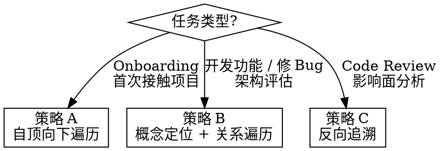

# BRIEF 模式 — 支撑开发

## 核心职责

按任务需求，向开发者（人/智能体）暴露基于当前任务所必须的完整项目知识链。

## 导航策略



### 策略 A：自顶向下遍历

**适用**：项目 Onboarding，首次接触项目需建立全局心智模型。

```
1. 读取 VISION.md（根节点）
2. 沿 children 逐层展开
3. 按广度优先遍历
4. 按需停止（用户/智能体判断已获取足够认知）
```

### 策略 B：概念定位 + 关系遍历

**适用**：开发具体功能、修复 Bug、架构决策评估。这是最高频的场景。

```
1. Tier 1 发现
   grep .vision/ 目录下所有文档的 front-matter
   匹配 concepts / description 与当前任务的关键词
   → 定位目标文档

2. Tier 2 加载
   读取目标文档正文

3. 沿 depends_on 完整上溯
   获取从概念到细节的前置知识链
   不设深度限制——由任务需求决定加载范围

4. 沿 referenced_by 补充
   获取横向关联知识

5. Tier 3 按需
   加载正文中引用的附属资源（图表、schema 等）
   仅在判断需要时才加载
```

### 策略 C：反向追溯

**适用**：Code Review（从变更反查设计意图）、影响面分析（评估修改的波及范围）。

```
1. 从变更文件/目标模块出发
   定位与之相关的 .vision 文档

2. 沿 depends_on 上溯
   获取设计理由和架构决策

3. 沿 children + referenced_by 正向扩散
   评估变更的影响面
```

## 场景与策略映射

| 场景 | 策略 | 说明 |
|------|------|------|
| 项目 Onboarding | A | 自顶向下，广度优先 |
| 开发具体功能 | B | 定位 → 完整上溯 → 关联补充 |
| 修复 Bug | B | 定位模块文档 → 上溯依赖链 |
| Code Review | C | 从变更反查设计意图 |
| 架构决策评估 | B | 定位架构文档 + 相关 ADR |
| 影响面分析 | C | 从目标文档正向扩散 |

## 关键原则

- **完整链路加载**：开发任务需要从设计理由到接口定义到实现约束的完整知识链。不人为限制遍历深度。
- **三级协议控制单文档粒度**：Tier 1 发现 → Tier 2 正文 → Tier 3 附属资源。这控制的是每份文档内部的加载粒度，不是文档间的遍历深度。
- **用户上下文补全**：由于用户记忆有限，BRIEF 输出时始终包含完整上下文，不假设用户记得之前的内容。
