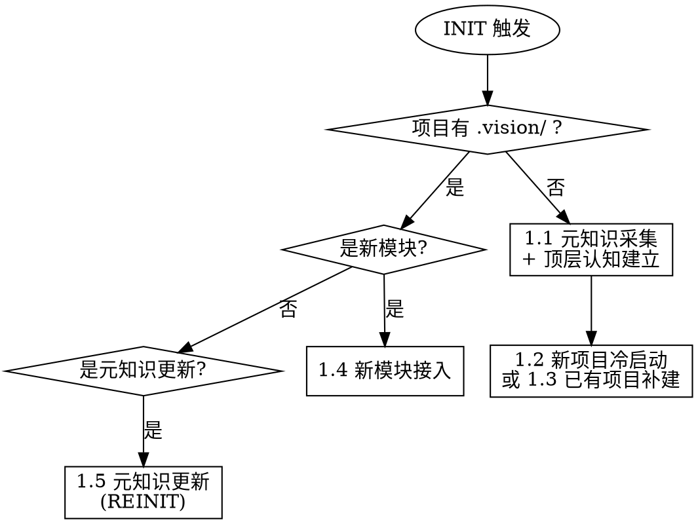

# INIT 模式 — 建立认知

## 触发时机

- 新项目首次使用 vision-maker
- 已有项目首次接入
- 新模块加入现有文档体系
- 元知识需要更新（REINIT）

## 场景路由

## 场景 1.1：元知识采集 + 顶层认知建立

**产出**：`.vision/.meta/knowledge.md` + `.vision/VISION.md`

### 步骤

1. **采集项目信息**
   通过与用户的对话，了解：
   - 项目所属行业和领域
   - 项目要解决的核心问题
   - 核心使用场景
   - 领域内的关键概念和术语
   - 团队规范、技术栈约束

   > 同时根据对话内容初始化 `.vision/.meta/user.local.md`，刻画用户知识面。用户提出的问题 = 暴露未知，用户输入的知识 = 确认已知。

2. **确定文档分层方案**
   基于项目规模和复杂度，确定：
   - 文档体系分几层
   - 每层的语义名称（如 `architecture/`、`modules/`）
   - 每层面向的消费者和认知目标

3. **确定评审维度**
   - 基础维度由 Skill 内置（必要性、完整性、准确性、可参考性、关系完整性）
   - 识别项目特定维度（如合规性、安全性等）

4. **产出 knowledge.md → 人审批**
   使用模板 `assets/templates/knowledge-template.md`，填充采集到的信息。

5. **产出 VISION.md → 人审批**
   使用模板 `assets/templates/vision-template.md`，填充项目顶层认知。

### 对话引导策略

INIT 阶段的对话遵循用户适配原则：
- 每次只问一个问题
- 优先使用多选题，降低用户认知负担
- 给出明确推荐和理由
- 将用户散碎的回答组织为结构化内容
- 主动识别用户未提及但可能重要的方面

## 场景 1.2：新项目文档冷启动

**前置**：已完成场景 1.1

### 步骤

1. **创建目录结构**
   基于 `knowledge.md` 中的分层定义，创建 `.vision/` 下的目录。

2. **确定文档蓝图 → 人审批**
   列出每层需要哪些文档、每份文档的职责和覆盖的 concepts。

3. **逐份生成文档 → 每份人审批**
   按优先级逐份生成，每份使用 `assets/templates/document-template.md` 的 front-matter 规范。

4. **建立文档关系**
   填充每份文档的 `depends_on`、`children`、`referenced_by` 字段。
   校验双向一致性：A 的 `children` 含 B，则 B 的 `depends_on` 须含 A。

5. **运行 REVIEW 模式**
   检查初始文档体系质量。参见 `references/review-mode.md`。

## 场景 1.3：已有项目补建

**前置**：已完成场景 1.1

### 步骤

1. **分析现有项目**
   读取代码结构、README、注释、配置文件、已有文档。

2. **与元知识对照**
   识别哪些认知需求已有文档覆盖、哪些缺失。

3. **按场景 1.2 步骤 2-5 补建**
   对已有文档进行迁移或引用，不重复造轮子。

## 场景 1.4：新模块接入

### 步骤

1. **读取现有文档体系结构**
   了解当前的分层、已有模块的文档模式。

2. **确定新模块文档在体系中的位置**
   遵循现有分层和命名约定。

3. **生成新模块文档 → 人审批**

4. **更新关联文档的关系字段**
   - 父层文档新增 `children` 指向新模块
   - 相关模块新增 `referenced_by`
   - 校验双向一致性

## 场景 1.5：元知识更新（REINIT）

### 步骤

1. **更新 knowledge.md → 人审批**
   修改受影响的章节。

2. **评估级联影响**
   触发 MAINTAIN 模式的场景 3.4（元知识变更级联）。参见 `references/maintain-mode.md`。
