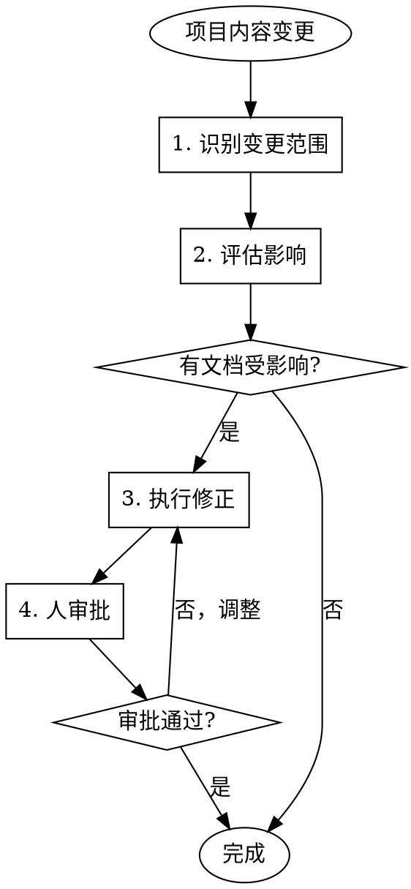

# MAINTAIN 模式 — 同步认知

## 核心职责

当项目内容发生变更后，**审慎检查**变更对文档体系的影响，调整受影响的文档内容，使文档体系与项目实际状态**始终保持一致**。

## 工作流程



### 步骤 1：识别变更范围

- 分析代码变更涉及了哪些 concepts
- 通过 concepts 匹配定位 `.vision/` 中可能受影响的文档
- 方法：grep 所有文档 front-matter 的 `concepts` 字段，匹配变更涉及的概念

### 步骤 2：评估影响

逐份检查受影响文档，判断影响级别：

| 影响级别 | 说明 | 动作 |
|---------|------|------|
| **内容需更新** | 文档描述的行为/接口/数据与代码不再一致 | 更新正文 |
| **关系需调整** | 依赖关系发生变化 | 修改 depends_on / children / referenced_by |
| **文档需拆分或合并** | 模块边界发生变化 | 重组文档 + 重建关系 |
| **需新增文档** | 变更引入了新概念/模块，现有文档未覆盖 | 触发 INIT 场景 1.4 |

### 步骤 3：执行修正

- 更新文档内容
- 调整 `depends_on` / `children` / `referenced_by` 关系
- **校验双向关系一致性**：
  - A 新增 `children` B → B 的 `depends_on` 须包含 A
  - A 移除 `children` B → B 的 `depends_on` 须移除 A
  - 同理适用于 `referenced_by` 的双向性
- 更新 `last_verified` 日期

### 步骤 4：人审批

将所有修改建议（变更内容、变更理由、影响范围）呈现给人确认。

## 场景明细

### 3.1 代码变更后文档同步

**触发**：代码提交 / 功能合并

```
1. 分析变更涉及的 concepts
2. grep .vision/ 中 concepts 匹配的文档
3. 逐份检查文档准确性
4. 修正偏离的内容
5. 更新 last_verified
6. 人审批
```

### 3.2 架构变更后文档重组

**触发**：模块拆分 / 合并 / 重命名

```
1. 识别受影响的文档
2. 确定文档需要拆分、合并还是重命名
3. 执行文档重组
4. 重建所有受影响的关系字段
5. 校验双向一致性
6. 人审批
```

### 3.3 新增决策记录

**触发**：做出重要技术决策

```
1. 创建新的 ADR 文档（在对应层级的 adr/ 目录下）
2. 填充 front-matter（type: explanation）
3. 更新相关架构文档的 referenced_by 关系
4. 人审批
```

### 3.4 元知识变更的级联影响

**触发**：REINIT 更新了 knowledge.md

```
1. 对比变更前后的 knowledge.md
2. 识别哪些章节发生了变化
   - 文档粒度定义变化 → 可能需要重组目录结构
   - 评审维度变化 → 需要更新 REVIEW 标准
   - 领域概念变化 → 可能影响文档内容和 concepts 标签
3. 逐项评估影响并执行修正
4. 人审批
```
