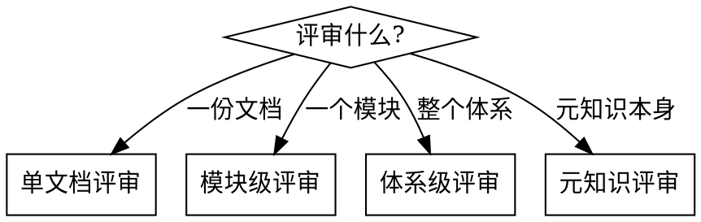

# REVIEW 模式 — 评审质量

## 核心职责

检查文档体系整体或单个文档的生成质量。评审维度由基础维度（Skill 内置）+ 项目特定维度（从元知识派生）共同构成。

## 评审维度

### 基础维度（适用所有项目）

| 维度 | 检查内容 |
|------|---------|
| **必要性** | 这份文档是否有存在的理由？是否有消费者需要它？是否与其他文档重复？ |
| **完整性** | 文档是否覆盖了它 `concepts` 字段声称的所有概念？是否有遗漏？ |
| **准确性** | 文档内容是否与当前代码/架构一致？是否有过时描述？ |
| **可参考性** | 文档结构是否清晰？人/智能体是否能快速找到所需信息？ |
| **关系完整性** | `depends_on` / `children` / `referenced_by` 是否有效？ |

### 项目特定维度

由 `.vision/.meta/knowledge.md` 中的"评审维度"章节定义。在 INIT 阶段与用户共同确定。

示例：
- 金融项目：合规性（是否覆盖监管要求）
- 医疗项目：数据隐私（是否标注敏感数据处理）
- 开源项目：贡献者友好度（是否有足够的上手引导）

## 评审范围



### 单文档评审

按所有维度（基础 + 项目特定）逐项检查一份文档。

```
检查清单：
- [ ] 必要性：该文档是否有明确消费者？
- [ ] 完整性：concepts 字段列出的概念是否在正文中全部覆盖？
- [ ] 准确性：与当前代码对照，内容是否准确？
- [ ] 可参考性：结构是否清晰？description 是否准确摘要？
- [ ] 关系完整性：depends_on/children/referenced_by 指向是否有效？
- [ ] last_verified 是否合理（未过期太久）？
- [ ] [项目特定维度]
```

输出：评审报告（逐项结论 + 改进建议）

### 模块级评审

检查一个模块所有文档的整体覆盖度和一致性。

```
检查清单：
- [ ] 模块内文档是否覆盖了该模块的所有核心 concepts？
- [ ] 文档间关系是否完整（无断链、无孤立文档）？
- [ ] 文档粒度是否合理（不过粗也不过细）？
- [ ] 与其他模块文档的 referenced_by 关系是否完整？
```

### 体系级评审

全文档体系的健康检查。

```
检查清单：
- [ ] 覆盖度：代码中的模块/功能是否都有对应文档？
- [ ] 时效性：是否有文档的 last_verified 过期太久？
- [ ] 关系完整性：
  - depends_on / children / referenced_by 指向的文件是否存在？
  - 是否有孤立文档（无任何关系连接）？
  - 是否有循环依赖？
  - 双向关系是否一致（A 的 children 含 B，B 的 depends_on 是否含 A）？
- [ ] VISION.md 的 children 是否覆盖所有顶层文档？
```

### 元知识评审

检查 `.vision/.meta/knowledge.md` 是否仍反映项目现状。

```
检查清单：
- [ ] 行业与领域描述是否准确？
- [ ] 核心场景是否有新增或变化？
- [ ] 领域概念体系是否有新术语或关系变化？
- [ ] 文档粒度定义是否仍然合适？
- [ ] 评审维度是否需要调整？
- [ ] 项目特定约束是否有变化？
```

## 评审输出格式

```markdown
## 评审报告

**范围**：[单文档 / 模块 / 体系 / 元知识]
**目标**：[文档路径或模块名]
**日期**：YYYY-MM-DD

### 评审结论

| 维度 | 状态 | 说明 |
|------|------|------|
| 必要性 | 通过/问题 | ... |
| 完整性 | 通过/问题 | ... |
| ... | ... | ... |

### 发现的问题

1. [问题描述] — [建议的修正方式]
2. ...

### 改进建议

1. [建议描述]
2. ...
```
